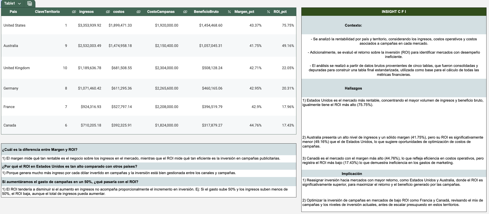

# AdventureWorks Financial Performance Analysis (SQL)

## Project Overview
In this project, I act as a data analyst at AdventureWorks. The finance director wants to understand which markets generate the highest revenue and profitability in order to guide future marketing investments.

Using SQL, I analyze sales transactions, products, territories, and marketing campaign data to evaluate financial performance across different countries.

## Business Questions
The analysis focuses on answering two key questions:

1. Which countries generate the most revenue?
2. Which markets are the most profitable after considering marketing expenses?

## Dataset
The analysis uses a subset of the AdventureWorks dataset with the following tables:

- **ventas_2017** – sales transactions for 2017
- **productos** – product catalog including cost and price
- **productos_categorias** – product category hierarchy
- **clientes** – customer information
- **territorios** – country and continent mapping
- **campanas** – marketing spending by territory

## Tools
- SQL
- Relational databases
- Data cleaning and transformation
- Financial KPI analysis

## Key Metrics
The following financial metrics were calculated:

- Revenue
- Cost
- Gross Profit
- Profit Margin
- Marketing ROI

## Methodology
1. Explored the relational schema and identified relationships between tables.
2. Joined sales, product, and territory data using SQL.
3. Cleaned and prepared the data (handling NULL values and data types).
4. Calculated financial KPIs such as revenue, profit, and ROI.
5. Validated results using quality checks.

## Key Insights

The analysis revealed several important findings about market performance:

- **United States** is the most profitable market, generating the highest revenue and gross profit, with the strongest marketing ROI (75.75%).
- **Australia** shows strong revenue and a healthy profit margin, but its ROI (49.16%) is significantly lower than the United States, suggesting opportunities to optimize campaign spending.
- **Canada** has the highest profit margin (44.76%), indicating efficient operational costs, but its marketing ROI is the lowest among the analyzed markets.
- Some markets generate solid revenue but have relatively low marketing efficiency, indicating potential for campaign optimization.

These findings suggest that marketing investments should prioritize markets with stronger ROI while reviewing campaign strategies in lower-performing territories.

## Dashboard

Below is a preview of the financial analysis dashboard created for this project.

You can also download the full dashboard here:

[Download Dashboard](Financial_Dashboard.pdf)

## Author
Juanita Pinzón
